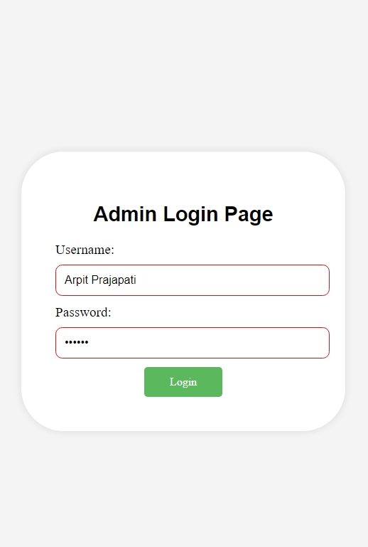

# Admin-LoginPage




### Files

- `index.html`: The main HTML file for the web project.
- `styles.css`: The CSS file for styling the HTML page.
- `login.php`: The PHP file for handling login.
- `start_server.sh`: A shell script to start the PHP built-in server.

## How to Run the Project Locally

### Prerequisites

- PHP should be installed on your system. You can download it from [php.net](https://www.php.net/downloads).

### Steps to Run

1. **Clone the repository:**

    ```sh
    git clone https://github.com/GET-UNKNOWN-ERR0R/Admin-LoginPage.git
    cd Admin-LoginPage
    ```

2. **Make the server script executable (if not already):**

    ```sh
    chmod +x start_server.sh
    ```

3. **Start the PHP built-in server:**

    ```sh
    ./start_server.sh
    ```

4. **Open your browser and go to:**

    ```
    http://localhost:8000
    ```

    You should see your `index.html` file rendered in the browser.

## License

This project is licensed under the MIT License. See the [LICENSE](LICENSE) file for more details.
